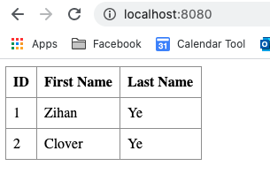

# My first Spring project

Combine tutorials in:

[Spring Quickstart Guide](https://spring.io/quickstart)

[Building a RESTful Web Service](https://spring.io/guides/gs/rest-service/)

[Building REST services with Spring](https://spring.io/guides/tutorials/rest/)

[Accessing Data with JPA](https://spring.io/guides/gs/accessing-data-jpa/)

## TL;DR

- Create a basic RESTful service with Spring Boot.
- Use Spring Data JPA

## Notes

### A basic RESTful service

`@SpringBootApplication ` is annotation that adds:
- @Configuration: tags the class as a source of bean definitions for the application context
- @EnableutoConfiguration: : Tells Spring Boot to start adding beans based on classpath settings, other beans, and various property settings
- @ComponentScan: tells Spring to look for other components, configurations and services in the com/example package, letting it find the controllers


The main() method uses Spring Boot's SpringApplication.run() method to launch an application

`@RestController`: marks the class as a controller where every method returns a domain object instead of a view

**Run the service**

`./mvnw spring-boot:run`

http://localhost:8080/greeting

http://localhost:8080/greeting?name=User

--> gives: 
`{"id":2,"content":"Hello, User!"} // json representation of an instance of class Greeting`

http://localhost:8080/hello

http://localhost:8080/hello?name=Clover


### Spring JPA

- Set up an entity class (Employee)
- Create a repository extending JpaRepsitory
- LoadEmployeeDatabase to save some initial data into the database on startup
- Write a controller that do create/read/update/delete operations

**Run the service**

```
$ ./mvnw clean spring-boot:run
$ curl -v localhost:8080/employees
$ curl -v localhost:8080/employees/99
$ curl -X POST localhost:8080/employees -H 'Content-type:application/json' -d '{"firstName": "Samwise", "lastName": "Gamgee"}
$ curl -X PUT localhost:8080/employees/3 -H 'Content-type:application/json' -d '{"name": "Samwise", "lastName":"Smith"}'  
$ curl -X DELETE localhost:8080/employees/3
```

### Spring HATEOAS

write hypermedia-driven outputs. Make service RESTful

- write a modelAssembler (EmployeeModelAssembler), which convert entity (Employee) to an EntityModel that passes as a part of response to GET
- in controller's GET method, return EntityModel instead of  entity
- For POST/PUT method, return a ResponseEntity with itself's link

After this:

```
curl -v -X POST localhost:8080/employees -H 'Content-type:application/json' -d '{"firstName": "Samwise", "lastName": "Gamgee"}
```
gives:

```
> POST /employees HTTP/1.1
> Host: localhost:8080
> User-Agent: curl/7.64.1
> Accept: */*
> Content-type:application/json
> Content-Length: 47
> 
} [47 bytes data]
* upload completely sent off: 47 out of 47 bytes
< HTTP/1.1 201 
< Location: http://localhost:8080/employees/4
< Content-Type: application/hal+json
< Transfer-Encoding: chunked
< Date: Fri, 01 Jan 2021 22:13:50 GMT
< 
{ [174 bytes data]
100   215    0   168  100    47  24000   6714 --:--:-- --:--:-- --:--:-- 30714
* Connection #0 to host localhost left intact
* Closing connection 0
{
   "_links" : {
      "self" : {
         "href" : "http://localhost:8080/employees/4"
      },
      "employees" : {
         "href" : "http://localhost:8080/employees"
      }
   },
   "id" : 3,
   "firstName" : "Samwise",
   "lastName" : "Gamgee"
}

```
```
curl -v localhost:8080/employees/3 | json_pp
```
gives:

```
// ...
{
   "id" : 3,
   "_links" : {
      "employees" : {
         "href" : "http://localhost:8080/employees"
      },
      "self" : {
         "href" : "http://localhost:8080/employees/3"
      }
   },
   "firstName" : "Samwise",
   "lastName" : "Gamgee"
}
```

### Spring + React

Connect the RESTful API we have so far with some frontend.

- ``npm init`` to configure package.json
- add dependencies:

```
npm install webpack webpack-cli --save-dev
npm install babel-loader --save-dev
npm install --save-dev @babel/core @babel/preset-env
npm install --save-dev @babel/preset-react

npm install react react-dom
```
- add proxy in package.json: ``"proxy": "http://localhost:8080"``

- add index.html

- start coding react!


### Result:



### Annotations

SpringBoot:

```
@SpringBootApplication 	// a meta-annotation that pulls in component scanning, auto-configuration, and property support.
```

Spring Rest:

```
@RestController // marks the class as a controller where every method returns a domain object instead of a view
@Entity
@GetMapping
@PostMapping
@PutMapping
@DeleteMapping
```

Advice:

```
@ControllerAdvice
@ResponseBody	// signals that this advice is rendered straight into the response body
@ExceptionHandler	// configure the advice to only respond if EmployeeNotFoundException is thrown
@ResponseStatus
```

Configuration:

```
@Configuration 		// tags the class as a source of bean definitions for the application context
@Bean
```

Spring JPA:

```
@EntityScan
@EnableJpaRepositories
@Id
@GeneratedValue
```
